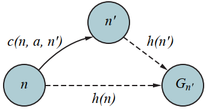

# A\* Search
[Wikipedia](https://en.wikipedia.org/wiki/A*_search_algorithm)

A\* is the most common informed search algorithm. A\* search is a best-first seach that uses the evaluation function
$$f(n)=g(n)+h(n)$$
where $g(n)$ is the path cost from the initial state to node $n$, and $h(n)$ is the *estimated cost* of the shortest path from $n$ to a goal state, so we have
$$f(n)=\text{estimated cost of the best path that continues from }n\text{ to a goal}$$

A\* search is complete. Whether A\* is cost-optimal depends on certain properties of
Admissible heuristic the heuristic[^ai-modern]:

- A key property is **admissibility**: an admissible heuristic is one that never overestimates the cost to reach a goal. With an admissible heuristic, A\* is cost-optimal.

- A slightly stronger property is called **consistency**. A heuristic $h(n)$ is consistent if, for every node $n$ and every successor $n'$ of $n$ generated by an action $a$, we have:
  $$h(n) \le c(n,a,n')+h(n')$$

  

## Suboptimal search algorithms
- Bounded suboptimal search

  In bounded suboptimal search, we look for a solution that is guaranteed to be within a constant factor $W$ of the optimal cost. Weighted A\* provides this guarantee.
- Bounded-cost search

  In bounded-cost search, we look for a solution whose cost is less than some constant $C$.
- Unbounded-cost search

  In unbounded-cost search, we accept a solution of any cost, as long as we can find it quickly.

### Weighted A\* search
Weighted A\* search weights that heuristic value more heavily:
$$f(n)=g(n)+W\times h(n)$$
for some $W\gt 1$.

[^ai-modern]: Russell, Stuart J. Artificial Intelligence a Modern Approach. Pearson Education, Inc.,