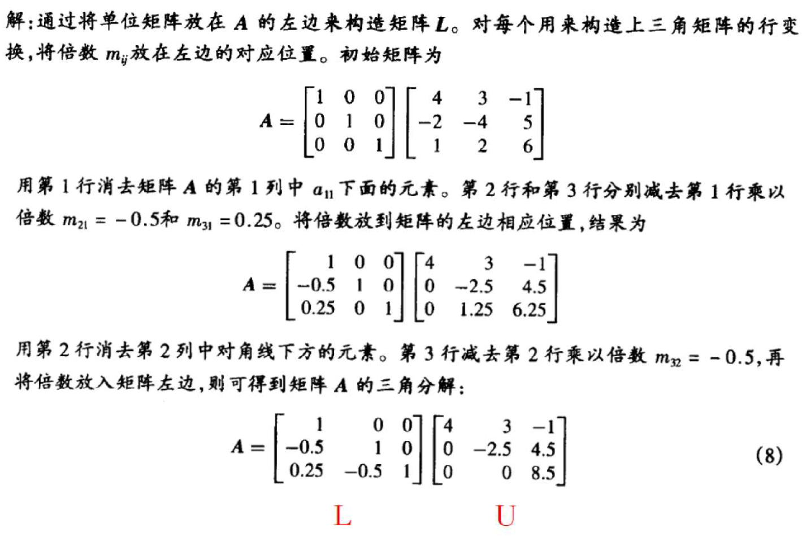

# Lower-Upper Decomposition
**Lower-upper decomposition** factors a matrix as the product of a lower triangular matrix and an upper triangular matrix. LU decomposition can be viwed as the matrix form of [Gaussian elimination](Gaussian%20Elimination.md).[^wiki]

[^wiki]: [LU decomposition - Wikipedia](https://en.wikipedia.org/wiki/LU_decomposition)

## Algorithms
### Using Gaussian elimination
例子：构造下列矩阵的 LU 分解：

$$\begin{bmatrix}
4 & 3 & -1 \\
-2 & -4 & 5 \\
1 & 2 & 6
\end{bmatrix}$$

## Permutation-lower-upper decomposition
例子：构造下列矩阵的 LU 分解：

$$\begin{bmatrix}
1 & 2 & 6 \\
4 & 8 & -1 \\
-2 & 3 & 5
\end{bmatrix}$$

解：  

## Applications
### Solving linear equations
Assume
$$\mathbf{A}=\mathbf{L}\mathbf{U}$$

$$\begin{align}
\mathbf{L}\mathbf{y}&=\mathbf{b} \\
\mathbf{U}\mathbf{x}&=\mathbf{y}
\end{align}$$

therefore

$$\begin{align}
y_1&=b_1 \\
y_k&=b_k-l_ky_{k-1}
\end{align}$$

and

$$\begin{align}
x_n&={y_n \over u_n} \\
x_k&={1\over u_k}(y_k-r_kx_{k+1})
\end{align}$$