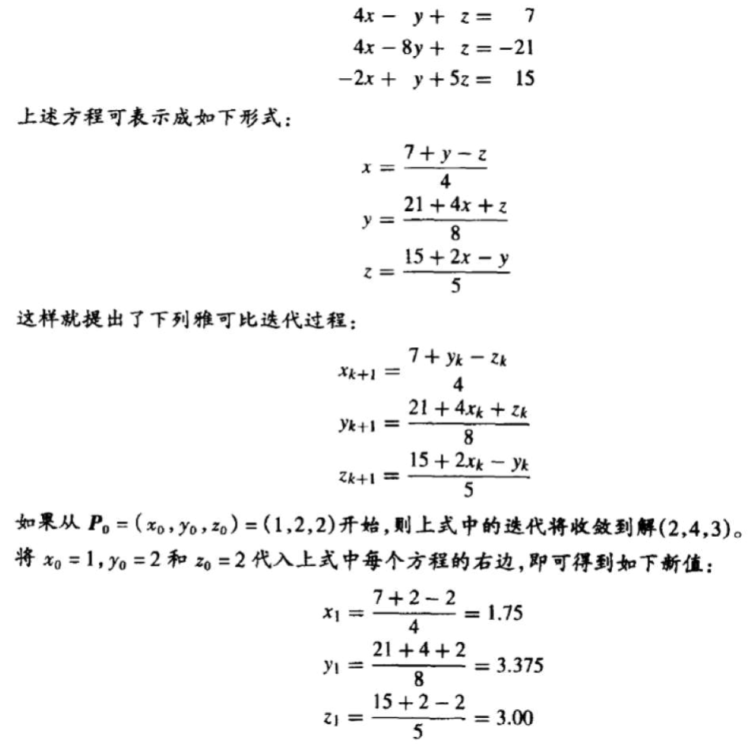

# Jacobi Methods
## Jacobi method
$$\mathbf{A}\mathbf{x}=\mathbf{b}$$

$\mathbf{A}$ can be decomposed into a diagonal component $\mathbf{D}$, a lower triangular part $\mathbf{L}$ and an upper triangular part $\mathbf{U}$:
$$\mathbf{A}=\mathbf{D}+\mathbf{L}+\mathbf{U}$$

The solution is then obtained iteratively via
$$\mathbf{x}^{(k+1)}=\mathbf{D}^{-1} (\mathbf{b}-(\mathbf{L}+\mathbf{U})\mathbf{x}^{(k)})$$

The element-based formula is thus:[^jacobi-wiki]
$$x_i^{(k+1)}={1\over a_{ii}} (b_i - \sum_{j\ne i} a_{ij}x_j^{(k)}),\quad i=1,2,...,n$$

例子：  


### 实现
Sage 实现：
```python
def jacobi_method(A, b, x0, delta):
    D = matrix(A.nrows(), A.ncols(), lambda i,j: A[i,j] if i == j else 0)
    LU = A - D
    D = D.inverse()
    while True:
        x1 = D * (b - LU * x0)
        if (x1 - x0).norm() < delta:
            break
        x0 = x1
    return x1
```

```python
def jacobi_method(A, b, x0, delta):
    while True:
        x1 = vector(RR, len(x0))
        for i in range(A.nrows()):
            x1[i] = 1/A[i,i] * (b[i] - sum(A[i,j] * x0[j] for j in filter(lambda j: j != i, range(A.nrows()))))
        if (x1 - x0).norm() < delta:
            break
        x0 = x1
    return x1
```

## Gauss-Seidel method
基于 Jacobi method，在计算 $x_i^{(k+1)}$ 时利用上已经计算出的新值 $x_1^{(k+1)}, x_2^{(k+1)}, \cdots, x_{i-1}^{(k+1)}$：

$$x_i^{(k+1)}={1\over a_{ii}} (b_i - \sum_{j=1}^{i-1}a_{ij}x_j^{(k+1)} - \sum_{j=i+1}^n a_{ij}x_j^{(k)}),\quad i=1,2,...,n$$

### 实现
Sage 实现：
```python
def gauss_seidel_method(A, b, x0, delta):
    while True:
        x1 = copy(x0)
        for i in range(A.nrows()):
            x1[i] = 1/A[i,i] * (b[i] - sum(A[i,j] * x1[j] for j in filter(lambda j: j != i, range(A.nrows()))))
        if (x1 - x0).norm() < delta:
            break
        x0 = x1
    return x1
```

## Successive over-relaxation


[^jacobi-wiki]: [Jacobi method - Wikipedia](https://en.wikipedia.org/wiki/Jacobi_method)