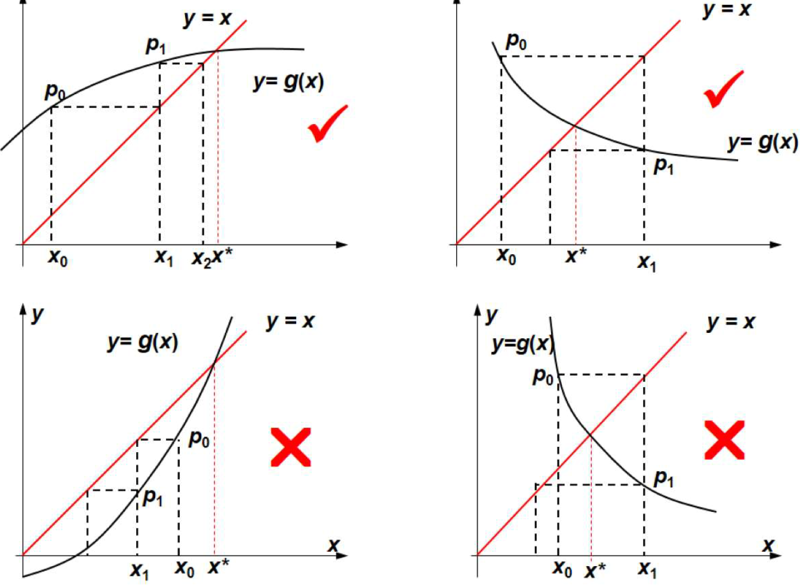

# Fixed-Point Iteration
See [Fixed Points](https://github.com/Chaoses-Ib/Mathematics/blob/main/Analysis/Functions/Fixed%20Points.md).

$$x_{k+1}=g(x_k)$$

算法：
1. 给定满足 $f(a)\cdot f(b)<0$ 的有根区间 $[a,b]$ 和精度要求 $\epsilon$
2. 确定 $f(x)=0$ 的等价形式 $x=\phi(x)$ 及初值 $x_0$
3. `do` $x_{k+1}=\phi(x_k)$
   1. `while not` $|x_{k+1}-x_k|<\epsilon$

几何解释：  


## Order of convergence
线性收敛

证明：

$$\begin{align}
\lim_{n\to\infty}{|x_{n+1}-x^\*| \over |x_n-x^\*|}
&=\lim_{n\to\infty}{|g(x_n)-g(x^\*)| \over |x_n-x^\*|} \\
&=\lim_{n\to\infty}{|g'(\xi)(x_n-x^\*)| \over |x_n-x^\*|} \\
&=\lim_{n\to\infty}{|g'(\xi)|} \ne 0 \\

\end{align}$$

## 实现
Sage 实现：
```python
def fixed_point_iter(g, x0, eps, max_iteration):
    for _ in range(max_iteration):
        x1 = g(x=x0)
        if abs(x1 - x0) < eps:
            break
        x0 = x1
    return x1
```