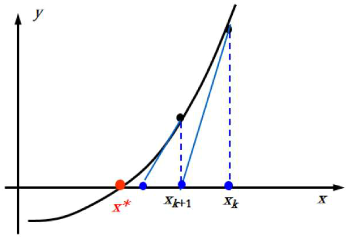

# Newton's Methods
## Newton's method
**Newton's method (Newton-Rapson method)**

对 $f(x)$ 在近似根 $x_k$ 附近作泰勒展开：
$$f(x)=f(x_k)+f'(x_k)(x-x_k)+ {f''(\xi)\over 2!}(x-x_k)^2$$
可得
$$f(x)\approx f(x_k)+f'(x_k)(x-x_k)$$

由 $f(x^\*)=0$ 得
$$f(x_k)+f'(x_k)(x^\*-x_k)\approx 0$$
即
$$x^\* \approx x_k-{f(x_k) \over f'(x_k)}$$

几何解释：  


缺点：
- $x_0$ 必须充分靠近 $x^\*$ 才能保证局部收敛

### 收敛阶
#### 局部收敛定理
若 $f(x)$ 在 $x^\*$ 的某个领域内二阶可导且 $x^\*$ 是单根，则存在 $x^\*$ 的某个领域 $N(x^\*)=[x^\*-\delta,x^\*+\delta]$， $\forall x_0\in N(x^\*)$，牛顿法的收敛阶不低于二阶。

#### 重根
若 $x^\*$ 是 $f(x)$ 的 $m\ge2$ 重根，则牛顿法线性收敛。

提高到二阶收敛：
- $\phi(x)=x-m{f(x)\over f'(x)}$
- $\mu(x)={f(x)\over f'(x)},\phi(x)=x-{\mu(x)\over\mu'(x)}$  
  $x^\*$ 是 $\mu(x)$ 的单重根

### 实现
Sage 实现：
```python
def newtons_method(f, x0, eps):
    dfdx = f.diff(x)
    while True:
        x1 = x0 - f(x=x0) / dfdx(x=x0)
        if abs(x1 - x0) < eps:
            break
        x0 = x1
    return x1
```

## Secant method
**Secant method (割线法)**

在 Newton's method 中：

$$x_{k+1} = x_k-{f(x_k) \over f'(x_k)}$$

为了避免计算导数，secant method 使用差商替代了导数：

$$\begin{align}
x_{k+1} &= x_k-{f(x_k) \over ({ f(x_k)-f(x_{k-1}) \over x_k-x_{k-1} })} \\
&= x_k-{f(x_k) (x_k-x_{k-1}) \over f(x_k)-f(x_{k-1})}
\end{align}$$

但这也导致了 secant method 收敛更慢。

### 实现
Sage 实现：
```python
def secant_method(f, x0, x1, eps):
    while True:
        f0, f1 = f(x=x0), f(x=x1)
        x2 = x1 - f1 * (x1 - x0) / (f1 - f0)
        if abs(x2 - x1) < eps:
            break
        x0, x1 = x1, x2
    return x2
```